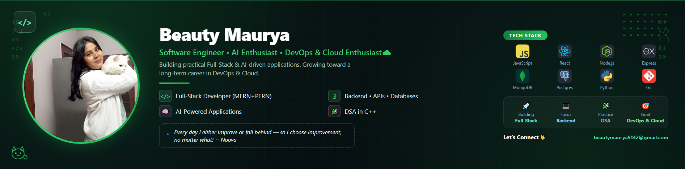

<h2 align="center">Hey there 👋 I'm Nova (aka Beauty) 🐈‍⬛</h2>

<h3 align="center">
  Full-Stack Developer • AI Enthusiast • DevOps & Cloud Enthusiast☁️
</h3>

  
  

---

### 👩‍💻 About Me

* 💻 BCA student with hands-on experience in **Full-Stack Development (MERN)**.
* 🗄️ Currently learning and strengthening my knowledge of **PostgreSQL** and relational databases.
* 🚀 Working on projects including **Learnex** and **Pipoo**.
* 🧠 Interested in **backend development, APIs, databases, AI, and building practical applications**.
* 📚 Consistently practicing **DSA with C++** to strengthen my problem-solving skills.
* 🗣️ Continuously improving my **communication, confidence, and technical explanation skills**.
* ☁️ My long-term direction is **DevOps & Cloud Engineering**, which I'll be exploring after strengthening my full-stack and database foundation.
* 💬 Ask me about: **JavaScript, React, Node.js, Express.js, MongoDB, PostgreSQL, REST APIs, C++, and Git/GitHub**.
* 📫 Reach me at: **[beautymaurya9142@gmail.com](mailto:beautymaurya9142@gmail.com)**
* 😄 Fun fact: Debugging at 2am hits different when there's food involved 🍕

 

  
  

---

### 🛠️ Tech Stack

  

  JavaScript • Python • C++ • React • HTML • CSS • Node.js • Express.js • MongoDB • PostgreSQL • Git • GitHub • Postman • VS Code

---

### 🌱 Currently Learning — August 2026

`PostgreSQL`  • 
`Relational Databases`  • 
`Backend Integration`

---

### 🚀 Where I'm Heading

I'm strengthening my foundation in **Full-Stack Development and Backend Engineering** while gradually preparing for my long-term goal of becoming a **DevOps & Cloud Engineer**.

Right now, my focus is on building a strong foundation through **PostgreSQL, backend development, and real-world projects**.

After completing my current projects, I'll move toward **Linux, Docker, networking, CI/CD, and cloud technologies** step by step.

I want to understand the complete journey of an application — from writing code and designing APIs to deploying, automating, and maintaining reliable systems.

Alongside technical growth, I'm continuously working on becoming a better **problem-solver, communicator, and engineer**.

---

### 📊 GitHub Stats

  
  

---

 ### 📈 Contribution Insights 

- 

  
  
  

<!-- 

  

 -->

---

### 🌐 Let's Connect

  
  &nbsp;&nbsp;
  
  &nbsp;&nbsp;
  

  📫 <strong>beautymaurya9142@gmail.com</strong>

---

<h3 align="center">
  ✨ Curious. Creating. Becoming. ✨
</h3>

<h3 align="center">
  Every day I either improve or fall behind — so I choose improvement, no matter what! 
  ~ Noova 🦋
</h3>
